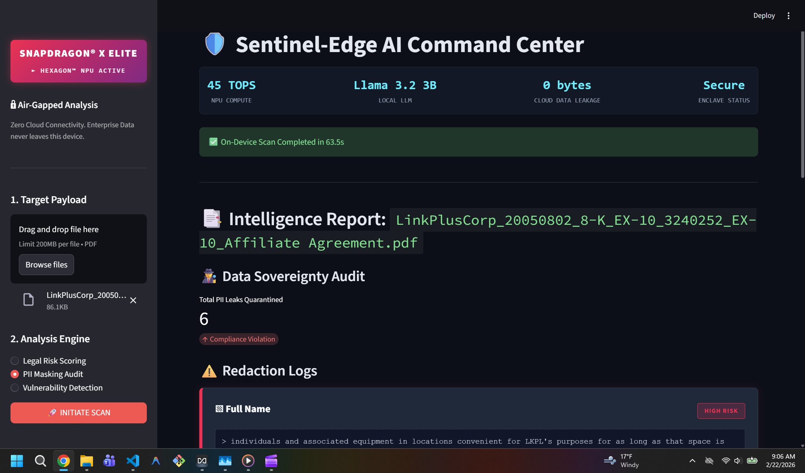
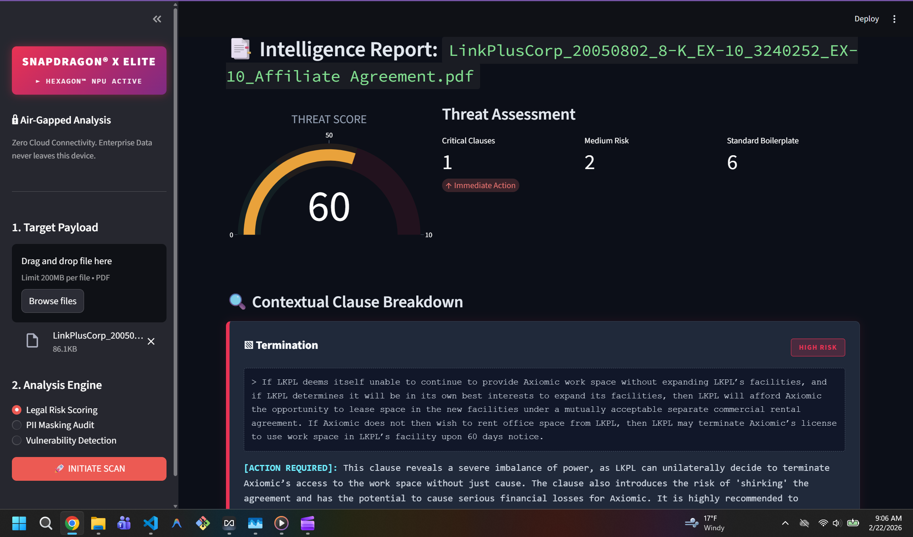
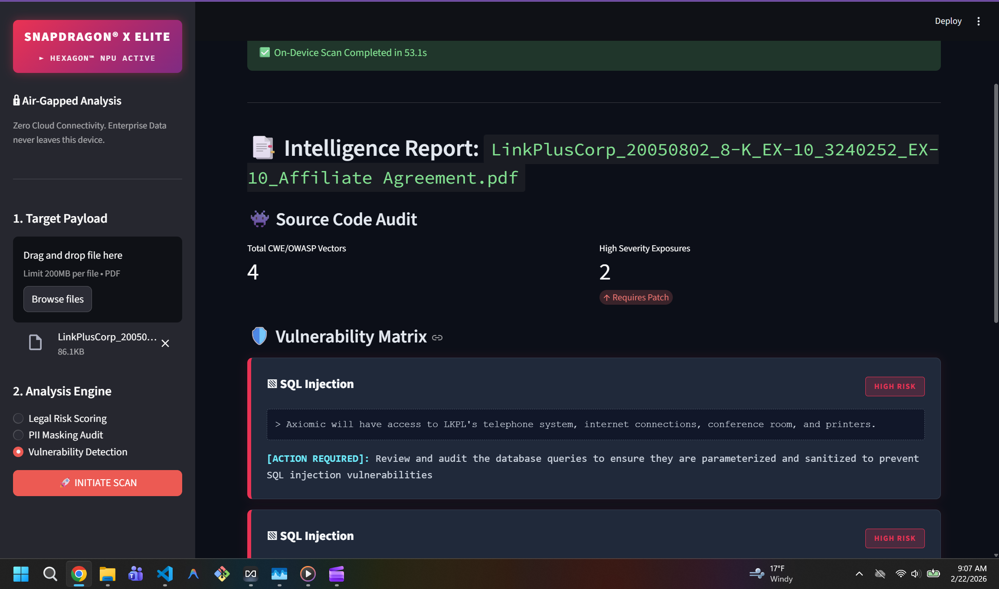

# SentinelAI
Enterprises in legal, defense, and finance cannot use AI on their most sensitive documents because every cloud LLM is a data leak risk. A lawyer cannot paste a client's contract into ChatGPT. A defense engineer cannot run their code through GitHub Copilot cloud. So they do nothing and stay unproductive.

Sentinel-Edge AI is an air-gapped AI security auditor that runs 100% on-device. Upload a legal contract or source code file - it detects risks, flags vulnerabilities, and generates a full report without a single network call. 

Powered by Llama 3.2 3B on the Snapdragon X Elite Hexagon NPU, every byte of your sensitive data stays on the machine.

## 🎬 Watch the Demo

*(Note: High-res video is too large for GitHub's web player)*

### [👉 CLICK HERE TO WATCH THE FULL VIDEO DEMO 👈](https://github.com/MadDataQualcommHackathon/SentinelAI/raw/main/assets/demo.mp4)

### Dashboard Previews

[//]: # (Drop your screenshot images into the repo and link them here)
 
*Caption: Sentinel-Edge AI evaluating an Affiliate Agreement for Legal Risks.*

 
*Caption: Sentinel-Edge AI : Legal Risk Scoring.*

 
*Caption: Sentinel-Edge AI : Vulnerability Detection.*

## Tech Stack

* **Hardware Acceleration:** Qualcomm Snapdragon X Elite (Hexagon NPU)
* **Local LLM Inference:** AnythingLLM hosting Llama 3.2 3B Instruct
* **Backend:** FastAPI, Python 3.11
* **RAG & Vector Storage:** ChromaDB (Local), LangChain, Local Embeddings
* **Document Processing:** pdfplumber
* **Frontend:** Streamlit, Plotly (for interactive telemetry and gauge charts)

## How It Works (The Pipeline)
1. **Air-gapped Ingestion:** A PDF is uploaded via the Streamlit UI and parsed locally.
2. **Context Retrieval:** The document is chunked and queried against a local ChromaDB instance pre-loaded with the CUAD (Contract Understanding Atticus Dataset) legal corpus.
3. **Hardware-Accelerated Inference:** The augmented prompt is sent to the local Llama 3.2 3B model running strictly on the Snapdragon NPU.
4. **Structured Output:** A custom validation loop ensures the LLM returns strict JSON, which is then rendered into threat-intelligence cards on the dashboard.

## Local Setup Instructions

### 1. Prerequisites
* A machine with a Snapdragon X Elite processor (for NPU acceleration).
* Python 3.11+
* AnythingLLM Desktop installed and running on port 3001.

### 2. Installation
Clone the repository and install the dependencies:
```bash
git clone [https://github.com/your-org/sentinelai.git](https://github.com/your-org/sentinelai.git)
cd sentinelai
pip install -r requirements.txt
